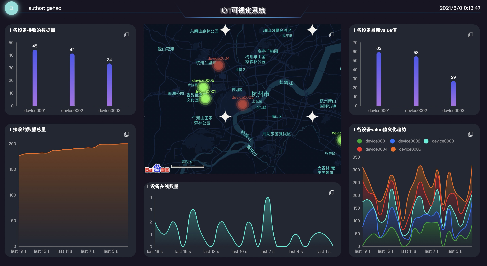
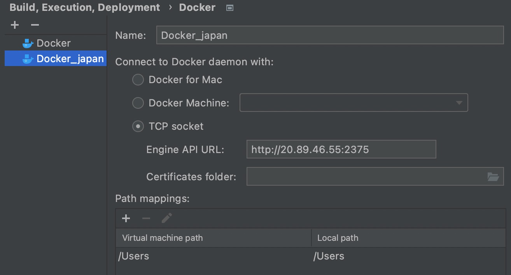

# 开发及使用手册

>   设计文档是前期对整体开发方向的把握，在具体实践过程中必然会有新的调整，本文档主要就是介绍具体开发过程和期间所选用的技术栈，顺便讲讲开发(自学)过程中遇到的问题和体会

#### 前后端技术栈

##### 技术栈概览

本项目采用的是前后端分离的设计方案，在大方向上以vue和springboot为主体：

-   前端：vue+vuex+ehcarts+element ui
-   后端：springboot+redis+mybatis+mysql+emqx
-   部署：docker+dockerfile+docker-compose

##### 前端技术栈

[Vue](https://cn.vuejs.org/index.html)是当前非常流行的JS **MVVM**库，其核心思想是**数据驱动**+**组件化**

所谓的MVVM就是Model-View-ViewModel，其中Model对应着数据，View则对应着DOM视图元素，它们之间通过ViewModel进行绑定

此外，Vue是单页面应用，每一个页面元素都可以看做是component，组件可以单独作为一个页面，也可以作为页面的一部分，编写Vue代码本质上就是编写一个个不同的component

~~~vue
<template>视图元素(组件)</template>

~~~

[Echarts](https://echarts.apache.org/zh/index.html)是一款基于JavaScript的数据可视化图表库，由百度团队开源，提供非常丰富的图表可视化工具，包括柱状图、折线图、饼图等，此外，它还和百度地图api兼容，虽然官方文档没有详细的说明，但还是提供了在地图上进行数据点和路径绘制的可行途径

[Element UI](https://element.eleme.io/#/zh-CN)则是一套基于Vue的桌面端组件库，它封装了按钮、单选框、多选框、表格、表单、抽屉、导航等基本组件，可以方便快速地搭建出一个界面，当然，缺点是组件不够丰富、定制化程度低，样式简陋，如果要写出满意的页面，需要额外花费许多经历去调整样式和结构

##### 后端技术栈

后端所采用的技术相对来说比较熟悉，内嵌Tomcat的SpringBoot作为服务器主体，Redis用于配置缓存，MySQL用于存储数据，MyBatis提供以面向对象的方式访问数据库，而Emqx则用于对mqtt服务的监听和转发，具体不再做过多说明

##### 环境部署

可以看到，前面这些工具，如果要在一台新的电脑上部署，尽管springboot相关的依赖都可以打包成jar包，但nginx、java、redis、mysql、emqx这几项独立服务都必须要进行重新下载和配置

每次部署都要重新配置环境无疑是一件很繁琐的事情，并且在不同操作系统(windows、macos、linux)下还会遇到各类奇怪的问题，因此我选择使用docker的方式，将以上这几项服务各自打包成镜像，并使用docker-compose工具对这些镜像进行编排和统一管理，只需要一个命令就可以自动化启动各服务对应的容器，并且保证容器之间的网络通信

#### 前端开发

##### 背景介绍

前端开发对我来说是工作量最大的一个环境，因为之前没有接触过相关技术，几乎要从头开始学起，幸运的是有Vue这样易于入门的前端框架，即使对html、css、javascript只是一知半解，也能够借助组件化+数据驱动的基本思想快速搭建出一套UI界面出来

根据要求，前端可以解耦成以下几个基本模块：

-   登录注册模块
-   IoT数据可视化界面
-   设备数据查询界面
-   设备信息配置界面

##### 登录注册模块

登录界面如下：如果已有账号，则直接登录即可，否则点击链接进行注册

注册模块如下所示：用户注册主要由用户名、密码、确认密码、邮箱这四部分组成

得益于vue的数据绑定特性，我们可以实时获取用户在输入框填写的内容，并根据既定规则进行合法性的提示：

-   用户名长度必须大于3，且在数据库中唯一
-   密码长度必须大于6
-   两次输入的密码必须匹配
-   邮箱必须满足特定格式(正则匹配)，且在数据库中唯一

##### IoT数据可视化界面

这一模块是整个系统的重点所在，服务端会接收来自iot客户端的数据，并存储于数据库中，而前端需要定期向服务端请求数据，并实时可视化显示一些统计信息

这里我利用Echarts工具实现了5个可视化界面，分别是：

-   地图界面：借助百度地图api，默认实时显示iot设备的位置，正常信息用绿色标注，报警信息用红色标注；如果想要展示某个设备的历史轨迹，可以直接鼠标点击地图上的某个iot设备，界面就会自动切换到轨迹
-   各设备接收的数据量：用于分别统计各个iot设备目前接收的数据量
-   接收的数据总量：用于实时统计当前服务端总共接收的数据量
-   设备在线数量：用于实时统计当前时刻在线的设备数量
-   各设备最新的value值：用于实时统计各设备最新的value值
-   各设备value值变化趋势：用于统计历史一段时间内各设备value值的变化趋势

注：如果点击地图上的某个设备点，则地图会切换为显示该设备历史一段时间内的轨迹，用数字标记时间点，同样也是用绿色和红色区分该时刻的设备状态

此外，点击每个图表右上方的按钮，可以将其放大至全屏，再次点击恢复原状

##### 设备数据查询界面

设备数据查询界面，默认分页展示所有历史数据

-   点击下方的分页栏可以跳转至指定页数
-   可以用关键字筛选数据
-   点击各列标题的上箭头或下箭头可以实现根据这一列属性值对数据进行正序或倒序排序

##### 设备信息配置界面

设备配置界面主要是对设备信息的配置：

-   设备名称默认为设备ID
-   点击编辑按钮，可以对设备ID或设备名称进行修改，点击保存后生效
-   点击删除按钮，可以删除该行设备信息
-   点击新增按钮，可以增加一行设备信息

##### 导航栏和主页

导航栏的实现着实花费了我一番功夫，由于我为整个系统布置了背景图，如果在上方或者左侧添加一个导航栏，显然会非常突兀，在可视化界面这个问题会更加明显

而响应式导航栏的设计理念非常符合当前的系统设计，我将所有的导航信息都隐藏起来，平时只以左上角的蓝青色按钮的形式存在，当用户想要切换页面时，点击该按钮，就可以弹出抽屉式的导航栏

此时，主页的设计也就变得简洁有效了：标题、个人信息、github和邮箱链接，以及导航栏按钮

#### 后端开发

##### 基本内容

由于我在阿里实习期间就是用SpringBoot相关技术做后端开发，因此这一模块相对来说比较简单，基本的设计想法是，通过Controller、Service、DAO进行工程架构，其中Controller层以restful api的形式向前端提供接口，Service层进行具体业务逻辑的处理，DAO层则定义数据对象和数据库访问

具体内容代码和注释写得很清晰了，基本都是CURD，没有太多需要介绍的地方

##### 缓存设计

这里有一个比较有趣的idea是利用redis做缓存设计，因为我在前端设置了定时器，定期往后端请求数据，而后端的数据又是实时更新的，如果同一时刻有很多用户同时访问该网站，那么缓存就会起到减轻数据库压力的作用

缓存本质上就是设计key和value的形式，这里我将其统一为字符串形式，其中key本身为字符串，而value可能是各种类型的对象，这里利用fastjson将其转化为字符串，并在读取缓存时又将其重新恢复为对象

为了避免用户给出的key过长，我在RedisService中对key进行了又一层封装，进行md5加密

~~~java
@Override
public Boolean put(String key, String value) {
    // cache key md5加密，避免key长度过大
    key = DigestUtils.md5DigestAsHex(key.getBytes());
    redisTemplate.opsForValue().set(key, value, expireTime, TimeUnit.SECONDS);
    return true;
}
~~~

一个基本的缓存使用例子如下：

~~~java
List<IotMessageDO> result = null;
if (redisService.exists(key)) {
    result = JSON.parseObject(redisService.get(key), 
                              new TypeReference<List<IotMessageDO>>(){});
} else {
    List<IotMessageDO> dataByKeyword = iotMessageMapper.getByKeyword(keyword);
    redisService.put(key, JSON.toJSONString(dataByKeyword), expireTime);
    result = dataByKeyword;
}
~~~

由于数据是实时刷新的，因此必须要为缓存设置过期时间expireTime，避免前端读取到过时的数据，值得一提的是，利用缓存过期时间这一特性，我实现了监听设备在线数量的功能

每次读取到mqtt的消息都会往数据库里插入一条记录，此时我会顺便往缓存里也存入这条记录，key为该iot设备的ID，并设置缓存过期时间为3s，以expireTime为间隔，如果期间没有再次收集到同一iot设备的数据来更新缓存，那么对应的key就会失效，此时就可以判定为该设备不在线

#### 开发体会

开发期间遇到了许多问题，通过搜索引擎和查看源码自我分析也逐一将其解决了，这个过程是漫长而痛苦的，但也是收获满满的，这里将我之前遇到的问题罗列出来

##### 跨域问题

在Vue中使用axios访问后端服务时，浏览器会遇到CORS跨域问题

跨域问题的出现是因为浏览器的同源策略，即必须保证两个页面具有相同的协议(protocol：http、https)，主机号(host)和端口号(port)，由于前后端服务的端口号不同，因此前端访问后端服务时就会遇上CORS跨域问题

解决方案：使用proxy代理，Vue其实是利用webpack-dev-server起一个本地服务器来加载前端代码，地址是 localhost:8080，为了规避跨域问题，webpack-dev-server提供了proxy功能(底层是http-proxy-middleware)，使前端代码向本地服务器localhost:8080提交请求，然后由本地服务器去请求真正的后端服务器(Node没有跨域限制)

到config/index.js文件中，找到proxyTable，加上：

~~~js
proxyTable: {
    '/api': {
        target: 'http://localhost:8443', // 后端地址
            changeOrigin: true, // 允许跨域
                pathRewrite: {
                    '^/api': '' // 重写路径
                }
    }
},
~~~

此时前端请求url中的所有`/api`都会被替换成`/`，由于在`main.js`里把`axios`的`baseURL`设置成了`/api`，因此调用`this.$http.get(“datainfo”)`发起http请求时，前端的请求url其实是`/api/datainfo`，然后根据我们的proxyTable，会把这个`/api`替换成空，即url变成了`/datainfo`，然后加上target地址，变成了`http://localhost:8443/datainfo`，此时在后端springboot就要配置为`@GetMapping("datainfo")`，而不是`@GetMapping("api/datainfo")`

但注意，webpack-dev-server是面向开发阶段发挥作用的，因此将`npm run build`生成的代码部署到服务器之后，是没办法再使用proxyTable进行转发的，通常需要自己配置Nginx代理进行请求的转发

~~~dockerfile
location /api/ {
    # 代理服务器
    # proxy_pass http://20.89.46.55:8443/;
    proxy_pass http://server:8443/;
    proxy_set_header Host $proxy_host;
    proxy_set_header X-Real-IP $remote_addr;
    proxy_set_header X-Forwarded-For $proxy_add_x_forwarded_for;
}
~~~

##### 绘制地图轨迹

Echarts是很好的绘制图表的工具，由于我们需要绘制出设备在地图上的信息，因此简单使用官网介绍的矢量地图数据是没有办法完成这个需求的，因为矢量数据仅精确到浙江省，而设备的地理位置是在杭州市

后来了解到Echarts可以兼容百度地图API，尽管相关的文档介绍很少，但起码有了解决思路

在vue根目录下的`main.js`中引入echart，挂载到vue的原型对象上，全局只需要用`this.$echarts`即可使用

~~~js
import echarts from 'echarts'
Vue.prototype.$echarts = echarts
~~~

然后引入百度地图api

~~~js
import 'echarts/extension/bmap/bmap'
~~~

遇到的问题是，Echarts绘制图表对setOption本身默认是做merge，不会删除原先已经绘制的旧点，如果我要在地图上绘制点，并实时刷新数据，就会出现很多历史数据点扎堆叠在一起的情况

为了解决这个问题，有两种思路：

-   删除整个ehcharts实例对象，并进行重新绘制：重载资源太浪费了

    ~~~js
    // 重置echarts，性能低，但目前官方并没有提供更好的方案
    resetEcharts() {
        // console.log(this.chartInstance.getOption())
        this.chartInstance.clear()
        this.chartInstance.setOption({bmap:{}})
    
        this.bmap = this.chartInstance.getModel().getComponent('bmap').getBMap()     
        this.bmap.addControl(new BMap.ScaleControl({anchor: BMAP_ANCHOR_BOTTOM_LEFT})) // 地图左下角显示比例尺
        this.bmap.setMapStyleV2({styleId: '8394c7f10d2cb459727e8c39ba0a3650'})
    }
    ~~~

-   setOption时删除旧的部分组件，做属性的替换而不是合并：https://echarts.apache.org/zh/api.html#echartsInstance.setOption，参考replaceMerge参数

    ~~~js
    this.chartInstance.setOption(dataOption, {replaceMerge: 'series'})
    ~~~

    当时我觉得这个参数好啊，完美解决了我目前的问题，但使用了之后发现并没有预期的结果，为此我以为是出了什么bug，还给Echarts提了[issue](https://github.com/apache/echarts/issues/15186)

    最后发现是我使用Echarts4.9.0版本不支持replaceMerge特性，需要升级到echarts5，然而升级到5之后，又和原先的代码有很多兼容性的冲突，故不得不放弃

-   最终没有特别好的解决方案，只能是按照merge的特点，把series的数据进行重新赋值重载(只要新的series数组和之前的长度相等、且属性完整，就会做等量替换)，尽管多写了一些不必要的多余代码，但起码实现了功能

##### 响应式导航栏的设计

一开始设计导航栏，直接贴在网页上方或者左侧显得非常突兀，此外，如果将每一个导航项都直接详细的列出来，适配移动端的话，就会因为移动端屏幕宽度的限制，导致在电脑端完美显示的布局在移动端可能就乱掉了

因此我想采用响应式导航栏的设计方式，用一个按钮来代替原来的导航栏，通过点击这个按钮来显示或隐藏具体的导航信息，可惜的是Element UI并没有提供响应式导航栏的组件，因此只能自己手写一个了

幸运的是，Element UI提供了抽屉组件[drawer](https://element.eleme.cn/#/zh-CN/component/drawer)，我们只需要将菜单组件[menu](https://element.eleme.cn/#/zh-CN/component/menu)嵌入抽屉组件之中，基础的导航栏就写好了，当然这一部分要默认隐藏

然后再设计一个显式的按钮，只有当按钮按下时，带有菜单的抽屉才会从左侧弹出，点击右侧任意空白空间，导航栏又会被隐藏，至此，响应式导航栏就设计完毕了

~~~vue
<template>
  

    <el-button
      type="menu"
      icon="el-icon-s-unfold"
      @click="drawer = true"
      circle
    ></el-button>
    <el-drawer :visible.sync="drawer" direction="ltr" class="drawer">
      <el-menu
        :default-active="activeIndex"
        mode="vertical"
        router
        @select="handleSelect"
        @open="handleOpen"
        @close="handleClose"
      >
        <el-menu-item index="/index">
          <i class="el-icon-s-home"></i>
          IoT物联网系统首页
        </el-menu-item>
        <el-menu-item index="/screen">
          <i class="el-icon-s-data"></i>
          IoT数据可视化界面
        </el-menu-item>
        <el-menu-item index="/query">
          <i class="el-icon-search"></i>
          设备数据查询界面
        </el-menu-item>
        <el-menu-item index="/config">
          <i class="el-icon-setting"></i>
          设备信息配置界面
        </el-menu-item>
      </el-menu>
    </el-drawer>
  

</template>
~~~

剩余的部分就是对Echarts和Element UI的使用了

##### Docker相关的配置

写完代码之后，想要部署到服务器，一个想法就是，实在不想每次都重新安装配置mysql、redis、emqx、nginx、java等软件了，因此就尝试使用docker的方式，将其整体打包成一个镜像组，能够统一编排和部署

这里我有一台自己的服务器：20.89.46.55，想要在本机直接对远程服务器上的docker进行配置和启动，因此在idea上安装了docker插件

服务端配置docker，开启远程安全访问：

~~~bash
sudo install docker.io
sudo vim /lib/systemd/system/docker.service
# 修改：ExecStart=/usr/bin/dockerd -H fd://  --containerd=/run/containerd/containerd.sock -H tcp://0.0.0.0:2375

# 加载配置+重启docker
sudo systemctl daemon-reload
sudo systemctl restart docker
# 验证
curl http://127.0.0.1:2375
~~~

idea安装docker插件，配置tcp，显示连接成功：

下方弹出services窗口，选中Docker_japan并连接，这个时候就可以显示我的远程机器上的docker镜像和容器了，由于之前我已经启动过docker-compose，因此机器上已经存在跟本项目相关的所有镜像了：

注意，想要启动远程机器的docker，本地机器得能够支持docker命令，因此本地先安装docker：

~~~bash
brew install --cask docker
~~~

然后在Docker插件->Tools栏下配置路径：

此时就可以编写docker-compose相关的yml文件对所需的第三方软件镜像进行编排管理了：

~~~yml
version: "3"

services:
  server:
    build: ./server # Dockerfile文件路径, 注意是目录名, 而不是文件名
    container_name: iot_server # 容器名
    restart: always
    depends_on:
      - emqx
      - mysql
      - redis
      - client
    ports:
      - "8443:8443"

  vue:
    build: ./vue
    container_name: iot_vue
    restart: always
    depends_on:
      - server
    ports:
      - "8080:8080"

  client:
    build: ./client
    container_name: iot_client
    restart: always
    depends_on:
      - emqx
    ports:
      - "8442:8442"

  emqx:
    image: emqx/emqx:v4.0.0
    container_name: iot_emqx
    restart: always
    ports:
    - "1883:1883"
    - "18083:18083"
    - "8883:8883"
    - "8083:8083"
    - "8084:8084"

  mysql:
    image: mysql:5.7.30 # mysql镜像版本
    container_name: iot_mysql # 容器名
    restart: always
    volumes:
      - ./mysql/init:/docker-entrypoint-initdb.d/ # 初始化建库建表操作, 不知道为啥没有生效
      - ./mysql/data:/var/lib/mysql # 将MySQL容器中的/var/lib/mysql目录挂载到宿主机的目录./mysql/data上
    environment:
      MYSQL_ROOT_PASSWORD: "gehao"
      MYSQL_USER: "gehao"
      MYSQL_PASS: "gehao"
    ports:
      - "3306:3306"

  redis:
    image: redis:6.2.1 # redis镜像版本
    container_name: iot_redis # 容器名
    restart: always
    volumes:
      - ./redis/data:/data # 将Redis容器中的/data目录挂载到宿主机的目录./redis/data上
    command: redis-server
    ports:
      - "6379:6379"
~~~

接下来就可以利用idea在本地直接运行远程的docker-compose了，它会先查看机器上是否已经有目标镜像了，如果没有就build相关镜像，否则就直接利用镜像生成对应的容器启动运行，`depends on`参数可以规定这些容器启动的先后顺序，保证依赖的服务能够先后启动

结果一看，springboot容器连接mysql总是失败，通过查看docker状态发现它一直处于restarting状态，根本没能运行起来

~~~bash
gehao@sakura:~$ sudo docker container ls
CONTAINER ID   IMAGE          COMMAND                  CREATED         STATUS                          PORTS     NAMES
a3b7e31e8d05   mysql:5.7.30   "docker-entrypoint.s…"   9 minutes ago   Restarting (1) 17 seconds ago             iot_mysql
~~~

后来看了docker-compose的官方文档才发现，这些被统一启动的机器默认在一个子网下，每个容器可以被看做是一个独立的IP地址，然而之前我在springboot的application.properties文件中，依旧使用localhost:port来连接服务的，显然这没法适用于容器之间的网络连接和通信

实际上，docker-compose会把yml文件中给每个镜像/容器的label作为其对应的IP地址，因此我们只需要用server、client、vue、emqx、mysql、redis这些label来代替配置项中的localhost即可完成网络通信

~~~properties
spring.datasource.url=jdbc:mysql://mysql:3306/iot?characterEncoding=UTF-8&serverTimezone=GMT%2B8&useSSL=false&autoReconnect=true&allowPublicKeyRetrieval=true
spring.redis.host=redis
iot.broker=tcp://emqx:1883
~~~

接下来mysql的启动正常了，但数据库的初始化失败了，本地的init文件夹没有被正确映射到远程容器的`/docker-entrypoint-initdb.d`文件夹(该文件夹下的所有sh和sql文件都会在初始化时执行)，因此我写的init.sql没有被执行，先尝试ssh登上远程机器，进入mysql容器，手动建库建表，此时springboot连接mysql终于成功了

springboot连接redis的过程非常顺利

但springboot一直没能连上emqx，当时我以为是emqx本身的问题，于是又给emqx提交了[issue](https://github.com/emqx/emqx/issues/5085)，在emqx开发人员的帮助下，我定位了自己的问题：当emqx的broker还没启动，springboot的docker就启动开始监听了，导致没法连接上emqx：这是docker自身的问题，前面所说的depends on参数只会控制docker容器之间的启动顺序，却不会监听容器内部服务的启动，也就是说，可能emqx的容器启动了，但emqx本身还没启动，但这个时候springboot容器已经启动开始连接emqx了，所以发生了错误

docker-compose的这个问题被很多很多人吐槽...

解决方案也还是有的，在springboot的Dockfile中使用[wait-for-it](https://github.com/vishnubob/wait-for-it/issues/57)脚本，只有监听到emqx:1883端口启动服务之后，springboot所属的server容器才开始启动，在server的Dockerfile修改ENTRYPOINT：

~~~dockerfile
ENTRYPOINT ["/wait-for-it.sh", "emqx:1883", "--timeout=60", "--", "java", "-jar", "/iotserver.jar"]
~~~

server镜像运行的结果：等待34s后emqx启动，springboot才开始运行

~~~bash
wait-for-it.sh: waiting 60 seconds for emqx:1883
wait-for-it.sh: emqx:1883 is available after 34 seconds
  .   ____          _            __ _ _
 /\\ / ___'_ __ _ _(_)_ __  __ _ \ \ \ \
( ( )\___ | '_ | '_| | '_ \/ _` | \ \ \ \
 \\/  ___)| |_)| | | | | || (_| |  ) ) ) )
  '  |____| .__|_| |_|_| |_\__, | / / / /
 =========|_|==============|___/=/_/_/_/
 :: Spring Boot ::        (v2.1.1.RELEASE)
~~~

根据上述手段，对msyql和redis也进行监听，由于ENTRYPOINT只能放一条命令，因此我们需要把wait-for-it的这段逻辑单独写到一个server-run.sh里

~~~bash
#!/usr/bin/env bash
# 运行iot server的脚本，需要等待mysql, redis, emqx的服务起来之后再启动jar包
/wait-for-it.sh mysql:3306 &&
/wait-for-it.sh redis:6379 &&
/wait-for-it.sh emqx:1883 --timeout=60 &&
java -jar /iotserver.jar
~~~

然后修改Dockerfile即可

~~~bash
FROM java:8
MAINTAINER gehao<sakura.gehao@gmail.com>
EXPOSE 8443
COPY ./target/iotserver-0.0.1-SNAPSHOT.jar /iotserver.jar
COPY ./wait-for-it.sh /wait-for-it.sh
COPY ./server-run.sh /server-run.sh
RUN chmod +x /server-run.sh # 加权限
ENTRYPOINT ["./server-run.sh"]
~~~

运行结果：

~~~bash
wait-for-it.sh: waiting 15 seconds for mysql:3306
wait-for-it.sh: mysql:3306 is available after 1 seconds
wait-for-it.sh: waiting 15 seconds for redis:6379
wait-for-it.sh: redis:6379 is available after 0 seconds
wait-for-it.sh: waiting 60 seconds for emqx:1883
wait-for-it.sh: emqx:1883 is available after 28 seconds

  .   ____          _            __ _ _
 /\\ / ___'_ __ _ _(_)_ __  __ _ \ \ \ \
( ( )\___ | '_ | '_| | '_ \/ _` | \ \ \ \
 \\/  ___)| |_)| | | | | || (_| |  ) ) ) )
  '  |____| .__|_| |_|_| |_\__, | / / / /
 =========|_|==============|___/=/_/_/_/
 :: Spring Boot ::        (v2.1.1.RELEASE)
~~~

还剩下最后一个问题：之前提到的mysql容器目录无法挂载，这个问题我排查了三四天，一直没有进展，一切显示都很正常，可目录就是没法挂载，直到后来我直接ssh登上远程服务器，本地运行了`docker-compose up -d`之后，发现竟然挂载成功了，最终我发现了问题所在：

因为我是用idea的docker插件，在本地机器起远程的docker容器，按照docker-compose所说，就相当于是把本地的目录挂载到远程机器的docker容器内的目录下，显然这是不合理的，远程主机的kernel它也没法访问本地的文件系统啊😭，因此挂载结果始终只有目录却没有文件，最终只要在远程主机上直接跑docker compose就好了，数据库表啥的都能够自动建好了

最后再把老师给的iotclient打包成jar包，把vue相关的文件也打包好，一起组织进docker-compose里，所有的环境、包依赖都统一编排好了，用户只需要在本地安装好docker，就可以通过`docker-compose up`这条命令一键部署所有的服务了