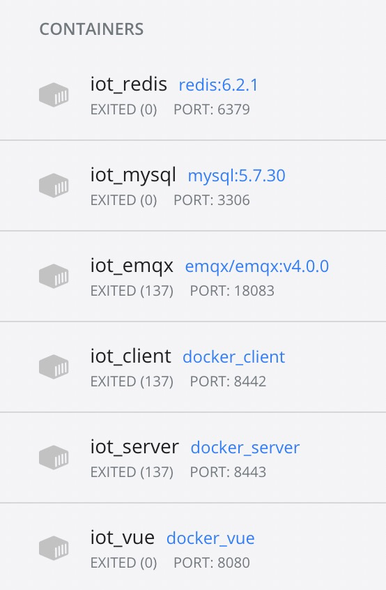

# 项目配置指导

>   可以使用docker启动，也可以自行安装依赖软件后本地启动

#### 使用docker启动

##### 背景介绍

本项目前后端分离，前端主要由vue开发完成，后端主要由springboot+redis+mysql+emqx开发完成，为了方便任何一个人、任何一台机器都能够直接部署本项目，我耗费了近4天的时间，几乎踩完了docker、dockerfile、docker-compose所有的坑，最终将所有独立的服务配置成docker镜像，而使用docker-compose工具对这些docker容器进行编排，从而使得只用一条命令就能启动多个容器，全自动化完成环境部署

这里配置的docker镜像和对应的容器列举如下：

##### 快速启动

想要启动前后端服务，你只需要`cd`进入`docker/`目录，并输入下面这行命令：

~~~bash
docker-compose up
~~~

随后，所有docker镜像对应的容器都会自行启动，命令行会输出它们启动时的Log信息，大约1-2分钟之后(第一次启动可能需要更长时间)，就可以访问`http://localhost:8080`来登录网站了

##### 注意事项

有几个注意点：

-   当你第一次运行上面这行命令时，由于需要在本地创建镜像，因此会耗费更多的时间，请耐心等待

-   本项目的docker映射了本机的几个端口号，启动docker之前请务必保证这些端口号不被占用(需要关闭本地运行的mysql、redis、emqx等服务，否则它们会和docker抢占端口)

    ~~~bash
    - 8080 # 前端访问端口号
    - 8443 # 后端访问端口号
    - 8442 # 老师提供的iotclient的端口号
    - 3306 # mysql的端口号
    - 6379 # redis的端口号
    - 1883 # 以下都是emqx的端口号
    - 18083
    - 8883
    - 8083
    - 8084
    ~~~

-   如果是macos系统，建议不要直接通过`brew install docker`安装docker，因为docker是系统级包，使用`brew install`安装会缺少必要的权限，详情可[参考](https://stackoverflow.com/questions/44084846/cannot-connect-to-the-docker-daemon-on-macos)，建议的安装命令：

    ~~~bash
    brew install --cask docker
    ~~~

#### 直接本地启动

##### 安装依赖软件

想要本地启动，需要本地先安装以下软件：

-   emqx:v4.0.0
-   redis:6.2.1
-   mysql:5.7.30
-   java:8
-   npm:7.11.2
-   node:15.14.0
-   vue:2.9.6

##### 配置并启动依赖软件

启动emqx：

~~~bash
emqx start
~~~

启动redis：

~~~bash
redis-server
~~~

启动mysql：

~~~bash
sudo /usr/local/mysql/support-files/mysql.server start
~~~

启动服务端：

~~~bash
建议直接利用idea打开并启动iotserver工程(springboot)
~~~

启动客户端：

~~~bash
建议直接利用idea打开并启动iotclient工程(springboot)
~~~

配置vue：先命令行进入iot-vue目录下，执行

~~~bash
npm install
~~~

启动vue：同样命令行进入iot-vue目录下，执行

~~~bash
npm run dev
~~~

##### 访问网站

在执行完`npm run dev`后，命令行会给出网站的预览地址，一般为`http://localhost:8080`，在浏览器中打开即可

