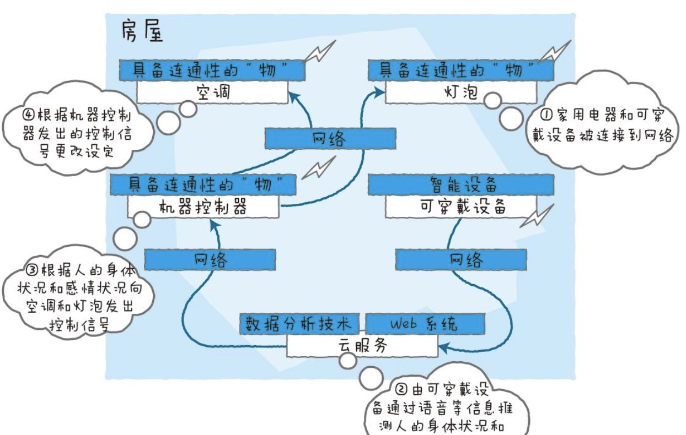
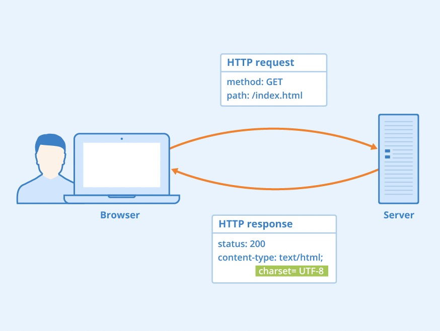
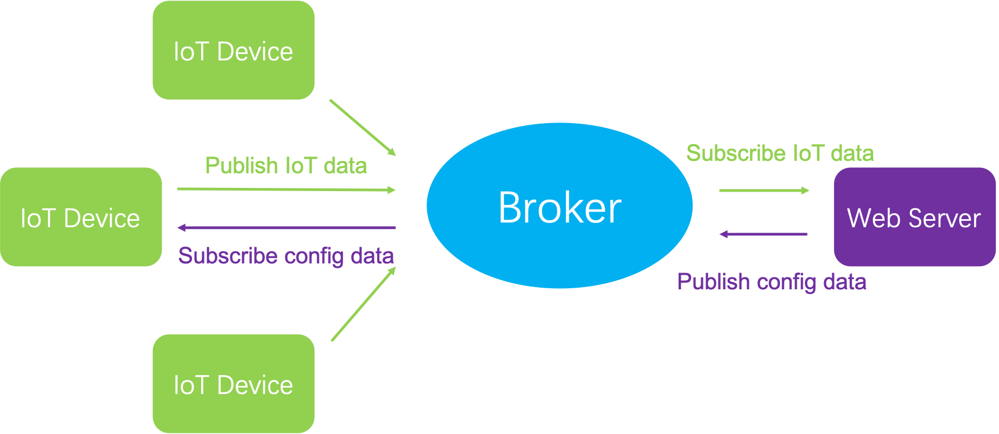
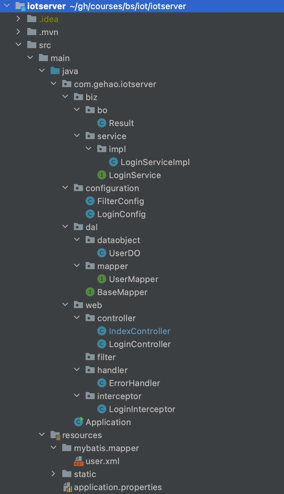
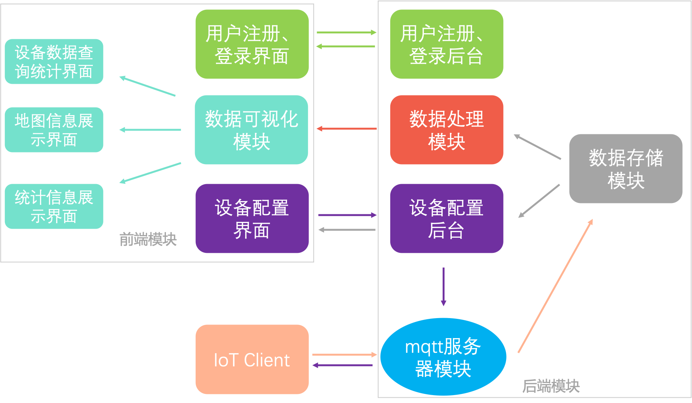

[TOC]

# BS：IoT设计文档

>   任选Web开发技术实现一个**物联网应用**的网站
>
>   葛浩 3180103494 计算机科学与技术

#### 1. 背景

##### 1.1 物联网概念

”物联网“一词的英文是Internet of Things，即IoT，其概念最早可追溯到1980年代初期，全球第一台隐含物联网概念的设备为位于卡内基·梅隆大学的可乐贩卖机，它连接到互联网，可以在网络上检查库存，以确认还可供应的饮料数

实际上，物联网本身的定义上还是集中于Internet，是一种物与物之间的连接方式，就目前物联网的发展趋势而言，它已经不是一个单纯的Internet，而进一步成为一种抽象意义的系统，或者说生态，我们目前更多的不是在关注其网络的连接，而是利用物联网构成了一种什么样的系统

往小的说，传统的internet是关于人的连接网络，主要是人与人时间传递信息，而发展到物联网之后，就不仅仅是人与人之间的连接了，更多的是人与物，物与物之间的连接关系，形形色色的“物”都可以通过internet相连

物联网本身是从连接的方式来定义的，但是目前随着物联网的发展，物联网更多的是与智能结合在一起，物联网目前应该是包含了**传感器**，**网络连接**，**终端设备**三个角色的具有智能的反馈型网络，下图给出了一个包含上述定义的物联网系统组成

##### 1.2 项目概述

在上述IoT的背景下，本项目的基本目标是**利用Web开发技术实现一个物联网应用的网站**

做项目其实跟搭积木差不多，想要完成一个项目，首先就要分析整个流程，并选择好使用哪些积木，这些积木也就是我们所要采取的技术，而每样技术又有不同的实现方式，即技术选型(这块内容将在后面阐述)，有了积木之后，接下来的任务就是设计好整个框架，用积木去搭建填充即可

上述步骤中，除了搭建木这个具体工程之外，剩余内容都属于项目设计的部分，也就是本设计文档要重点描述的内容

因此这里我先简单分析一下整个IoT项目运作的基本流程，再进一步地阐述完成这样一个项目设计需要用到哪些技术，具体的技术选型在后面的章节阐述

IoT项目的基本流程如下：

-   IoT设备通过网络将数据发送到我们的服务器
-   服务器在内存里接受数据，并将其写入数据库
-   服务器对数据进行处理，并将处理的结果返回前端显示
-   服务器还需要提供用户权限校验和注册、登录等功能

为了完成上述流程，我们需要用到的设备和技术如下：

-   IoT设备和传感器
-   IoT数据传输的网络协议
-   服务器
-   web后端技术
-   缓存与数据库技术
-   web前端技术

本设计文档主要将围绕上述技术的技术选型展开，并以web前后端技术架构为主体

#### 2. 技术选型

##### 2.1 IoT设备

由于本项目侧重于开发物联网应用的网站，而并非侧重于物理设备的开发，因此这里使用老师提供的iotclient工程来模拟终端发送数据

iotclient的实现原理也很简单，利用多个线程来模拟多台不同的设备device，并让它们定时地向服务器的`tcp://ip:1883`端口发送数据，数据的生成也很简单，根据杭州经纬度随机生成设备位置信息即可

~~~java
Vector<WorkerThread> threadVector = new Vector<WorkerThread>();
for (int i = 0; i < devices; i++) {
    WorkerThread thread = new WorkerThread();
    thread.setDeviceId(i + 1);
    thread.setMqttServer(mqttServer);
    thread.setTopic(topic);
    thread.setClientPrefix(clientPrefix);
    threadVector.add(thread);
    thread.start();
}
~~~

##### 2.2 数据传输协议

###### 2.2.1 MQTT介绍

IoT设备和服务器必然不在同一个物理设备里，而是处于网络上的两个节点，那么它们之间就需要用特定的协议来进行通信和收发数据

通常对于B/S场景，我们会用HTTP协议来进行浏览器和服务器之间的数据交互，而对于IoT设备和服务器之间的数据交互，这里采用的是MQTT协议

什么是MQTT呢，这里基于我个人的理解给出一个简要的概括：**MQTT**是一个极其轻量级的`发布/订阅`消息传输协议，适用于网络带宽较低的场合，它通过一个**代理服务器(broker)**，任何一个客户端(client)都可以订阅或者发布某个主题的消息，所有订阅了该主题的客户端都会收到该消息

更详细地说，MQTT是基于二进制消息的发布/订阅编程模式的消息协议，最早由IBM提出的，如今已经成为OASIS规范，由于规范很简单，**非常适合需要低功耗和网络带宽有限的IoT场景**，其基本设计原则如下：

-   精简，不添加可有可无的功能

-   发布/订阅（Pub/Sub）模式，方便消息在传感器之间传递

-   允许用户动态创建主题，零运维成本

-   把传输量降到最低以提高传输效率

-   把低带宽、高延迟、不稳定的网络等因素考虑在内

-   支持连续的会话控制

-   理解客户端计算能力可能很低

-   提供服务质量管理

-   假设数据不可知，不强求传输数据的类型与格式，保持灵活性

###### 2.2.2 MQTT v.s. HTTP

传统的B/S架构通常采用HTTP协议作为web传输数据的机制，那为什么不用让IoT设备以HTTP请求的形式发送数据，以HTTP响应的方式接收数据呢？实际上，HTTP是一种**很重**的协议，它包含许多标头和规则，并不适合受限的网络，且作为1对1的协议，服务器想要将消息传送到网络的所有设备上，不仅困难，成本也很高

此外，HTTP 是一种同步协议，客户端需要等待服务器响应，Web浏览器具有这样的要求，它的代价是牺牲了可伸缩性；在IoT领域，大量设备由于不可靠或高延迟的网络使得同步通信成为问题，此时异步消息协议就会更适合IoT应用程序，即传感器发送读数，让网络确定将其传送到目标设备和服务的最佳路线和时间

MQTT协议之所以如此轻量且灵活，离不开它的一个关键特性——发布和订阅模型，与所有消息协议一样，它将数据的发布者与使用者分离

MQTT协议在网络中定义了两种实体类型：一个消息代理和一些客户端：

-   代理是一个服务器，它从客户端接收所有消息，然后将这些消息路由到相关的目标客户端

-   客户端是能够与代理交互来发送和接收消息的任何事物，客户端可以是现场的IoT传感器，或者是数据中心内处理IoT数据的应用程序，在本项目是就是后端的web程序

首选客户端连接到代理，它可以订阅代理中的任何消息“主题”，此连接可以是简单的TCP/IP连接，也可以是用于发送敏感消息的加密 TLS 连接；然后客户端通过将消息和主题发送给代理，发布某个主题范围内的消息；最后代理将消息转发给所有订阅该主题的客户端

###### 2.2.3 本项目的协议架构

为了将MQTT协议运用到本项目中，我按照自己的理解制作了下述的流程图

由于MQTT消息是按主题进行组织的，而根据文档给出的实验要求，我们在协议层面要完成两件事情：接收IoT设备发送的数据包+向IoT设备发送更改配置信息的数据包

因此，需要🈶两个主题：“IoT”主题和“config”主题

-   对传感器来说：
    -   将实时采集到的数据在“IoT”主题范围内发布
    -   订阅web服务端发布的“config”主题，根据后端的要求创建或修改设备信息，如设备ID、设备名称等
-   对web服务端来说：
    -   接收系统管理员的命令来调整设备的配置，并在“config”主题范围发布
    -   订阅“IoT”主题范围内的数据，并将其保存到后端数据库、处理后发送给前端显示

##### 2.3 web后端技术

###### 2.3.1 主流后端技术介绍

目前的web后端技术有很多，主流的包括JAVAEE、SSM、Spring Boot等，通常业界都会使用SSM或Spring Boot来搭建自己的后端系统，比如我目前在实习的阿里集团就是用Spring Boot的升级版Pandora Boot来开发，其中包含了分布式RPC框架HSF、分布式非持久化配置中心ConfigServer、分布式缓存Tair、分库分表TDDL等待

当然，这些中间件都是作为微服务提供给各个中台、业务来开发使用的，涉及到成千上万台机器的集群，对于本项目来说，只有一台服务器提供web服务，因此无需用到上述的大部分组件

###### 2.3.2 本项目的后端技术栈

这里我选用的后端技术栈是Spring Boot+Maven+Redis+Mybatis+MySQL的配置，接下来做逐一介绍

**Springboot**：是Spring家族中的一个全新的框架，它是用来简单应用程序的创建和开发过程，化繁为简，简化SSM框架的配置；比如在使用SSM框架开发的时候，我们需要配置web.xml、配置spring、配置mybatis，再将它们整合到一起，而是用Springboot就不同了，它采用了大量的默认配置来简化这些文件的配置过程

**Maven**：Maven是Apache软件基金会唯一维护的一款自动化构建工具，专注于服务Java平台的**项目构建**和**依赖管理**，它基于项目对象模型(POM)，可以通过一小段描述信息来管理项目的构建、报告和文档

**Redis**：Redis是C语言开发的一个开源的高性能键值对(key-value)的内存数据库，可以用作数据库、缓存、消息中间件等，再本项目中用于作为MySQL数据库的缓存

**Mybatis**：MyBatis是一个持久层(DAO)框架，本质上是JDBC的一次封装，主要作用是方便我们进行数据库的增删改查CRUD操作，它使业务代码与JDBC相解耦

**MySQL**：互联网行业中最流行的数据库

##### 2.4 web前端技术

###### 2.4.1 主流前端技术介绍

目前主流的前端技术应该就是React和Vue框架了，由于我对前端技术不是那么了解，这里仅做简单介绍，本项目中前端的主要目的就是能让数据可视化出来，而不过分追求美观

下面给出维基百科对两种框架的介绍：

**React**：是一个为数据提供渲染为HTML视图的开源JavaScript库，React视图通常采用包含以自定义HTML标记规定的其他组件的组件渲染，React为程序员提供了一种子组件不能直接影响外层组件的模型，数据改变时对HTML文档的有效更新，和现代单页应用中组件之间干净的分离

**Vue.js**：Vue.js是一个用于创建用户界面的开源JavaScript框架，也是一个创建单页应用的Web应用框架；它是一套用于构建用户界面的渐进式框架，与其它大型框架不同的是，Vue被设计为可以自底向上逐层应用，Vue 的核心库只关注视图层，不仅易于上手，还便于与第三方库或既有项目整合，另一方面，当与现代化的工具链以及各种支持类库结合使用时，Vue也完全能够为复杂的单页应用提供驱动

###### 2.4.2 本项目的前端技术栈

实际上，由于Vue相比React更为简单上手，因此我选择了Vue+ElementUI+Axios作为前端的技术栈

##### 2.5 技术栈小结

本项目使用的技术栈小结如下：后端技术栈采用Spring Boot+Maven+Redis+Mybatis+MySQL，前端技术栈采用Vue+ElementUI+Axios

#### 3. 项目架构设计

前文已经介绍了本项目使用的技术栈，接下来我将介绍一下本项目整体架构上的设计

##### 3.1 架构设计抽象

对于前端工程，基本架构已经由Vue本身定义好，这里不再阐述

对于后端工程，这里采用MVC设计模式，并将整体架构的设计抽象如下：

-   终端显示层：即前端渲染显示部分
-   开发API层：后端提供的服务封装成HTTP接口，开放给前端调用
-   请求处理层(controller层)：主要包含Filter过滤和Intercept拦截功能，以及web请求的转发
-   service层：主要负责业务逻辑的处理，在service层之上还会有biz层和manager层，它们是对业务逻辑的进一步封装
-   DAO层：数据访问层，主要通过mybatis与底层的mysql数据库进行交互
-   数据存储层：即mysql数据库

##### 3.2 架构设计具体实践

根据上述架构抽象思想的原则，我将iotserver的架构具体设计如下：

首先根目录是`com.gehao.iotserver`，在根目录下主要分为以下几个一级子目录：

-   biz层：这一层对应着业务逻辑的实现，包括业务对象BO和业务代码service
    -   bo层：业务对象的定义，它封装了某个业务相关的所有属性和基本操作
    -   service层：业务逻辑代码的实现，包括interface接口以及impl目录下的具体实现
-   configuration层：存放的是自定义的`@configuration`注解，主要用于将自定义的filter或interceptor作为JAVA Bean进入到Spring Boot的生命周期里
-   dal层：存放的是数据访问相关的代码
    -   dataobject层：数据对象DO的定义
    -   mapper层：mybatis函数，它会和resources/mybatis/mapper下的xml文件一一对应
-   web层：存放的是web处理相关的函数
    -   filter、interceptor层：对过滤器、拦截器的定义
    -   handler层：对一些错误error的处理
    -   controller层：针对web访问请求的处理，它要做的仅仅是把对应的请求下发给具体的service处理，并将处理结果返回给web前端

注：由于本工程在刚开始搭建，因此仅实现了用户登录功能，但已经完成了项目架构上从0到1的实现，接下来的代码只需要在这个架构下添加补充内容即可

##### 3.3 功能模块设计与解耦

这里主要对将要实现的几个功能模块进行解耦和设计，具体的实现逻辑还是需要等写代码的时候落实，过早设计反而会起到反作用

在实验需求文档里提出了一些具体的功能要求：

-   搭建一个mqtt服务器，能够接收指定的物联网终端模拟器发送的数据

-   实现用户注册、登录功能，用户注册时需要填写必要的信息并验证，如用户名、密码要求在6字节以上，email的格式验证，并保证用户名和email在系统中唯一，用户登录后可以进行以下操作

-   提供设备配置界面，可以创建或修改设备信息，包含必要信息，如设备ID、设备名称等

-   提供设备上报数据的查询统计界面

-   提供地图界面展示设备信息，区分正常和告警信息，并可以展示历史轨迹

-   首页提供统计信息（设备总量、在线总量、接收的数据量等），以图表方式展示（柱状体、折线图等）

根据上述需求，我将功能解耦成下述几个模块，下图给出了我对整个系统的整体设计，其中同颜色的箭头表示相同数据源：

-   **数据存储模块**：主要存储mqtt服务器模块传过来的数据，并交给数据处理模块和设备配置模块使用

-   **mqtt服务器模块**：这一模块的思路已经在前面分析过了，只需要在服务器上跑一个broker代理，接下来相当于是在web服务器上再运行一个mqtt客户端，这个客户端订阅iotclient发送的数据，并将数据存储到数据存储模块中，此外它还接收用户给出的设备配置指令，并将修改信息发布给iot client
-   **数据处理模块**：主要对数据存储模块中保持的iotclient数据进行统计和处理，并将处理结果返回给前端可视化模块使用
-   **设备配置模块**：后台会从数据存储模块中取出iotclient发布的数据，并交给前端界面进行显示，同时也接收用户在前端给出的设备配置修改指令并转发给mqtt服务器模块
-   **用户注册、登录功能模块**：这一模块其实我已经实现了，在过滤器/拦截器上设计相应的验证代码即可，其中还需要对数据库的user表进行查询
-   **前端可视化模块**：主要负责显示渲染三个界面：
    -   设备数据查询统计界面
    -   地图信息展示界面
    -   统计信息展示界面

#### 4. 项目实现与安排

目前项目已经完成了从0到1的搭建过程，并完成了用户注册登录模块(包括前端和后端)，接下来将争取在一个月的时间内完成整个工程的任务，后续的安排如下：

-   先完成mqtt服务器模块，然后进一步完成数据存储模块，此时能够从iotclient中拿到数据并存入数据库中
-   然后再完成数据处理模块，这一模块与前面的强关联性不大，只需要从数据库读取数据并进行加工处理即可
-   然后开始搭建前端工程，先搭建数据可视化模块的三个界面，使得数据处理模块的结果能够渲染显示
-   最后再搭建设备配置模块，这一模块需要和mqtt服务器模块联合调试，并且需要修改iotclient的部分代码，使得设备修改能够在具体的IoT device(这里是模拟的线程)上真正生效